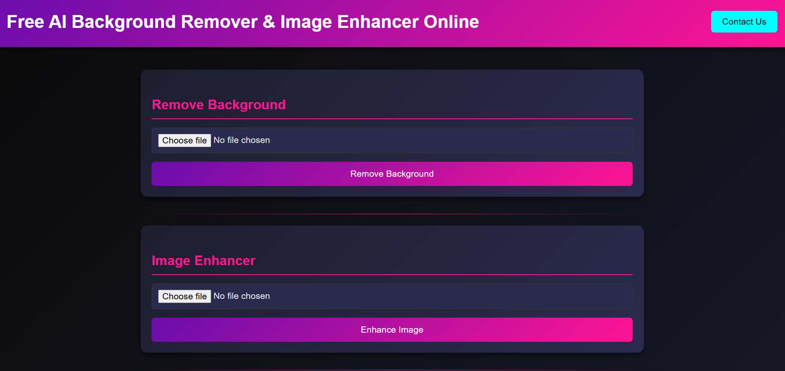
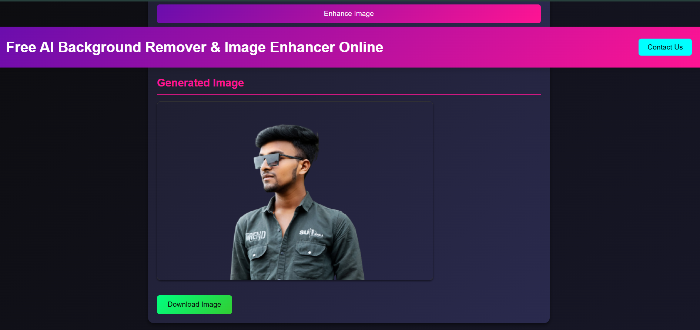

# AI-Powered Image Studio – Background Remover & Ghibli Style Generator

AI-Powered Image Studio is a simple yet powerful AI-based image processing web application built using Flask and Gradio.  
It combines lightweight background removal with experimental AI-style image generation in a clean and beginner-friendly project structure.

This project is ideal for learning, demonstrations, and resume showcasing, and it runs smoothly on low to mid-range laptops.

---

## 🚀 Key Features

- ✔ Instant background removal using AI
- ✔ Ghibli-style image generation (demo integration)
- ✔ Clean and simple web interface
- ✔ Flask backend for local processing
- ✔ Gradio integration for AI-heavy tasks
- ✔ Beginner-friendly architecture
- ✔ Resume-ready AI project

---

## 🛠 Tech Stack

**Frontend**
- HTML

**Backend**
- Python
- Flask

**AI & Processing**
- PyTorch
- torchvision
- rembg
- Pillow

**AI Interface**
- Gradio

---

## 📂 Project Modules

### 1️⃣ Background Remover (Flask)
- Runs locally
- Uses `rembg` for AI background removal
- Fast and lightweight processing

### 2️⃣ Ghibli Style Generator (Gradio)
- Demonstration-based AI style generator
- Uses Gradio for interactive UI
- Public links are temporary

---

## ▶️ How to Run the Project

### 1️Create & Activate Virtual Environment
📸 Output Screenshots

  <b>Front Page</b> 
  

 

  <b>Background Remove</b> 
  

---
## ⚠ Important Notes

- Gradio public links are temporary  
- A new link is generated after every restart  
- Flask app runs locally and remains stable  
- Ghibli-style generation is currently a demo placeholder  

---

## 🌟 Future Improvements

- Integration of real diffusion-based Ghibli model  
- Single unified Flask + AI pipeline  
- Enhanced UI using CSS or Tailwind  
- Image download functionality  
- Cloud deployment support  

---

## 👤 Author

**Devendra Dhote**  
📧 devendradhote32@gmail.com  
📱 +91 7920824051  

---

## 📄 License

This project is created for educational and learning purposes.  
You are free to modify, enhance, and build upon it.